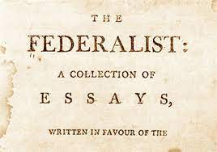
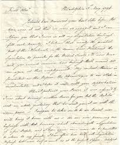
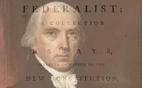

# Federalist Papers Review

* 

1. The Federalist Papers were originally published in New York.
1. 85 argumenative essays- stropnger federal Gov't
1. Alexander Hamaltin, James Jay, and James Madasin are the 3 main authors
1. New Constitution by September 17, 1787
1. The Federalists went by the same sir name "publius"

* 

1. First - Why a union- Firsty Argu essay
1. Second - The insufficiency of the present confederation to preserve the union
1. Third - The neciossity of a Gov't at least equally 
1. Fourth - The Confirmity of the rensurence of the republican Gov't
1. Fifth Simularity to your state constitusion
1. Sixth The Additional Security of Natural Rights
1. Seventh publish is pen name used by Jay Maddison and Hamalton

* 