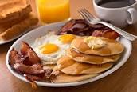
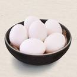
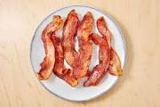

### Breakfast Notes

> In the U.S., many people eat breakfast foods at any meal

> The standard breakfast meal includes eggs, meat, potatoes, breads,  pancackes, waffles, cereals, fruit, and yogurt.

> Most restaurants that serve breakfast offer a variety of similar option and combinations.

> Foodservice workers must know how to prepare a wide variety of breakfast items.

### Eggs

> An egg has 3 main parts, the shell, the yolk, and the white.

> Cooking eggs isb one measure of a chefs skill.

> It is important to cook eggs at a moderrate temperature

### Bacon

> Most food servicce operations purchase pork bacon that is already sliced, although it is availabe in whole slabs.

> Bacon comes from the side of a pig, and is cured and often smoked for flavor.

> To help reduce shrinkage, cook bacon at a low temperature.
