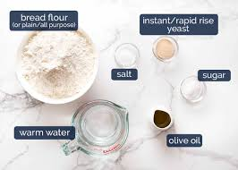
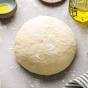

# Fabian Martinez, Period 6: Culinary arts notes

### Making Pizza
* 

1. pre-heat oven to 420 degrees.
1. flaten out dough to a shape of a circle
1. cover sauce and add extra to the rear end of the dough, fold dough onto its self on the ridges to creat crust.
1. Add cheese over everything but where the crust would be 
1. Put in oven for 30-35min and take out and enjoy.

### Ingredients
* 

1. 12 cups of all-purpose flour (plus extra for dusting)
1. 1 teaspoon of salt
1. 1 teaspoon of sugar (optional, for slightly sweet dough)
1. 1 tablespoon of active dry yeast (or instant yeast)
1. 3/4 cup of warm water (around 110°F or 45°C)
1. 2 tablespoons of olive oil or melted butter (optional, for flavor and texture)

### Instructions
* 

1. Activate the Yeast: In a small bowl, mix the warm water with the sugar (if using) until dissolved.
Sprinkle the yeast over the water and let it sit for about 5-10 minutes until it becomes frothy. This indicates that the yeast is active.

1. Mix Dry Ingredients: In a large mixing bowl, combine the flour and salt. Mix them together thoroughly.

1. Combine Wet and Dry Ingredients: Make a well in the center of the flour mixture and pour in the activated yeast mixture.
If you're adding olive oil or melted butter, pour it into the well as well. Using a wooden spoon or your hands, gradually incorporate the flour into the wet ingredients until a shaggy dough forms.

1. Knead the Dough: Once the dough starts to come together, transfer it to a lightly floured surface.
Knead the dough for about 5-10 minutes until it becomes smooth and elastic. Use the heel of your hand to push the dough away from you, then fold it back over itself and repeat.

1. First Rise (Proofing): Lightly oil a clean bowl and place the kneaded dough inside. Cover the bowl with a clean kitchen towel or plastic wrap. Let the dough rise in a warm, draft-free place for about 1-2 hours, or until it doubles in size. This step allows the yeast to ferment and create air bubbles, making the dough light and airy.

1. Punch Down and Shape: Once the dough has risen, gently punch it down to release the air. Transfer the dough to a floured surface and shape it according to your recipe's instructions. You can make loaves, rolls, pizza crusts, etc.